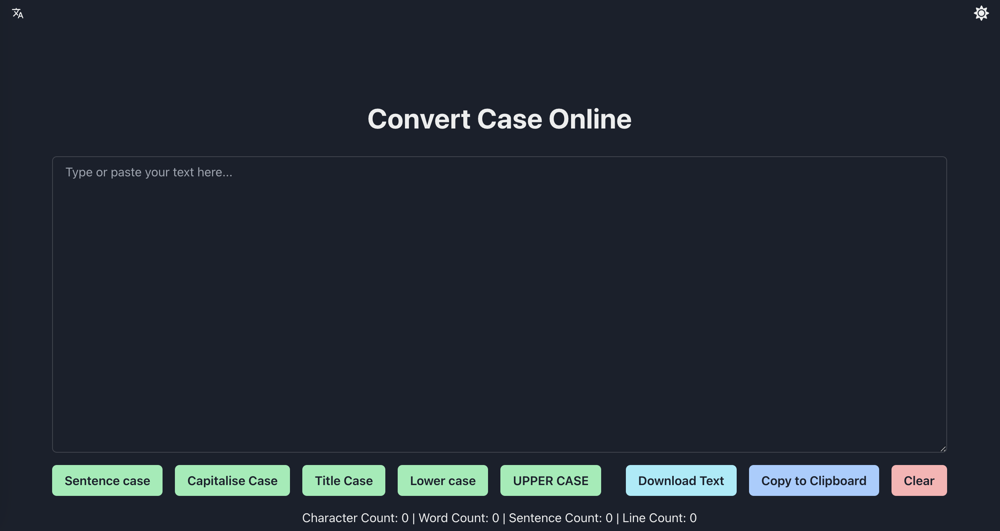

# convertcase-online

Free tool for converting uppercase and lowercase. 

英文字母大小写在线转换工具.


- [x] Sentence Case
- [x] lower case
- [x] UPPER CASE
- [x] Capitalise Case
- [x] Title Case
- [x] Character Count
- [x] Word Count

### Running Locally

After cloning the repo, you need to copy the `.env.example` file to create a `.env` file and fill in the required fields.

Then, run the application in the command line and it will be available at `http://localhost:3000`.

```bash
pnpm i

pnpm run dev
```

### Screenshot




### About Me

感谢一位即友的学习路线规划，[Next.js 与 chakra.ui 建`whois`站](https://github.com/gantrol/whois-nextjs/)。